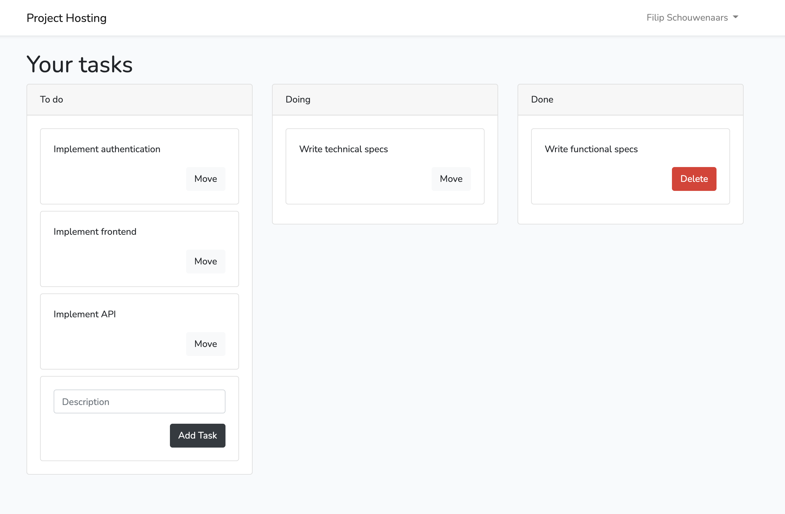

## Mello

Mello is a simple Trello-like web application written in Laravel. This example application should be deployable to the hosting solution that is designed and developed throughout the Project Hosting course (thaught at Thomas More in Geel).



## Version details

- PHP version 8.0.3
- MySQL version 8.0
- Laravel version 8.35.1

## Getting started

- Install Docker Desktop
- On Windows, install WSL2, as described [here](https://laravel.com/docs/8.x/installation#getting-started-on-windows)

```
# Start the app locally
./vendor/bin/sail up

# Run the database migrations
./vendor/bin/sail artisan migrate

# Compile assets
./vendor/bin/sail npm run dev

# Compile assets and minify
./vendor/bin/sail npm run prod
```

## Deployment

For the system requirements to run Laravel applications, check [this article](https://laravel.com/docs/8.x/deployment).

## Other resources

[Laravel's documentation](https://laravel.com/docs/8.x) is excellent.
